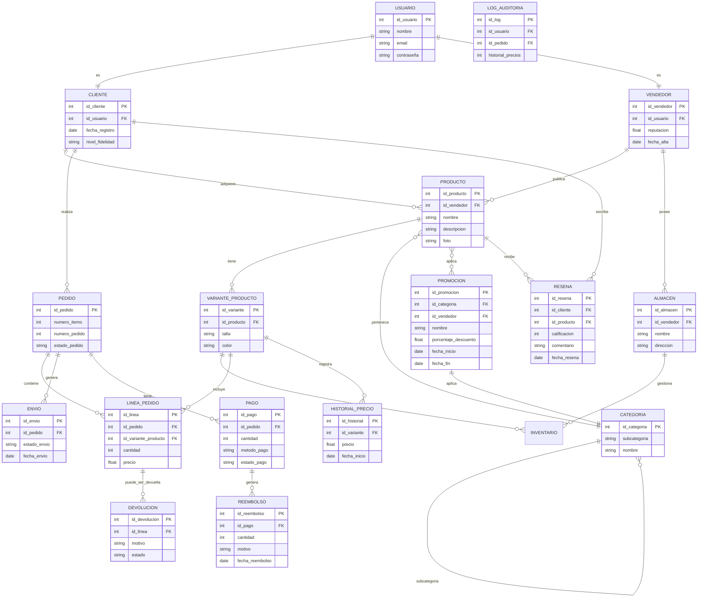

# DER Físico (Modelo Relacional) – Marketplace + Logística

```mermaid
erDiagram
    %% ==== RELACIONES ====
    USUARIO ||--|| CLIENTE : "es"
    USUARIO ||--|| VENDEDOR : "es"
    VENDEDOR ||--o{ PRODUCTO : "publica"
    CLIENTE ||--o{ PRODUCTO : "adquiere"
    PRODUCTO ||--o{ VARIANTE_PRODUCTO : "tiene"
    PRODUCTO }o--|| CATEGORIA : "pertenece"
    CATEGORIA ||--o{ CATEGORIA : "subcategoria"
    VARIANTE_PRODUCTO ||--o{ INVENTARIO : "tiene"
    ALMACEN ||--o{ INVENTARIO : "gestiona"
    VENDEDOR ||--o{ ALMACEN : "posee"
    CLIENTE ||--o{ PEDIDO : "realiza"
    PEDIDO ||--o{ LINEA_PEDIDO : "contiene"
    VARIANTE_PRODUCTO ||--o{ LINEA_PEDIDO : "incluye"
    PEDIDO ||--o{ ENVIO : "genera"
    PEDIDO ||--o{ PAGO : "tiene"
    PAGO ||--o{ REEMBOLSO : "genera"
    LINEA_PEDIDO ||--o{ DEVOLUCION : "puede_ser_devuelta"
    PRODUCTO }o--o{ PROMOCION : "aplica"
    PROMOCION ||--|| CATEGORIA : "aplica"
    CLIENTE ||--o{ RESENA : "escribe"
    PRODUCTO ||--o{ RESENA : "recibe"
    VARIANTE_PRODUCTO ||--o{ HISTORIAL_PRECIO : "registra"

    %% ==== ENTIDADES Y ATRIBUTOS ====
    USUARIO {
        int id_usuario PK
        string nombre
        string email
        string contraseña
    }

    CLIENTE {
        int id_cliente PK
        int id_usuario FK
        date fecha_registro
        string nivel_fidelidad
    }

    VENDEDOR {
        int id_vendedor PK
        int id_usuario FK
        float reputacion
        date fecha_alta
    }

    CATEGORIA {
        int id_categoria PK
        string subcategoria
        string nombre
    }

    PRODUCTO {
        int id_producto PK
        int id_vendedor FK
        string nombre
        string descripcion
        string foto
    }

    VARIANTE_PRODUCTO {
        int id_variante PK
        int id_producto FK
        string talla
        string color
    }

    ALMACEN {
        int id_almacen PK
        int id_vendedor FK
        string nombre
        string direccion
    }

    PEDIDO {
        int id_pedido PK
        int numero_items
        int numero_pedido
        string estado_pedido
    }

    LINEA_PEDIDO {
        int id_linea PK
        int id_pedido FK
        int id_variante_producto FK
        int cantidad
        float precio
    }

    ENVIO {
        int id_envio PK
        int id_pedido FK
        string estado_envio
        date fecha_envio
    }

    PAGO {
        int id_pago PK
        int id_pedido FK
        int cantidad
        string metodo_pago
        string estado_pago
    }

    REEMBOLSO {
        int id_reembolso PK
        int id_pago FK
        int cantidad
        string motivo
        date fecha_reembolso
    }

    DEVOLUCION {
        int id_devolucion PK
        int id_linea FK
        string motivo
        string estado
    }

    PROMOCION {
        int id_promocion PK
        int id_categoria FK
        int id_vendedor FK
        string nombre
        float porcentaje_descuento
        date fecha_inicio
        date fecha_fin
    }

    RESENA {
        int id_resena PK
        int id_cliente FK
        int id_producto FK
        int calificacion
        string comentario
        date fecha_resena
    }

    HISTORIAL_PRECIO {
        int id_historial PK
        int id_variante FK
        float precio
        date fecha_inicio
    }

    LOG_AUDITORIA {
        int id_log PK
        int id_usuario FK
        int id_pedido FK
        int historial_precios
    }
```