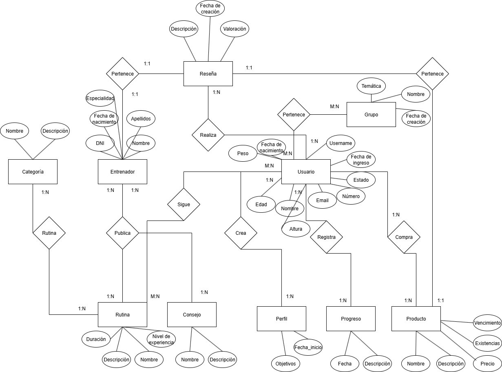
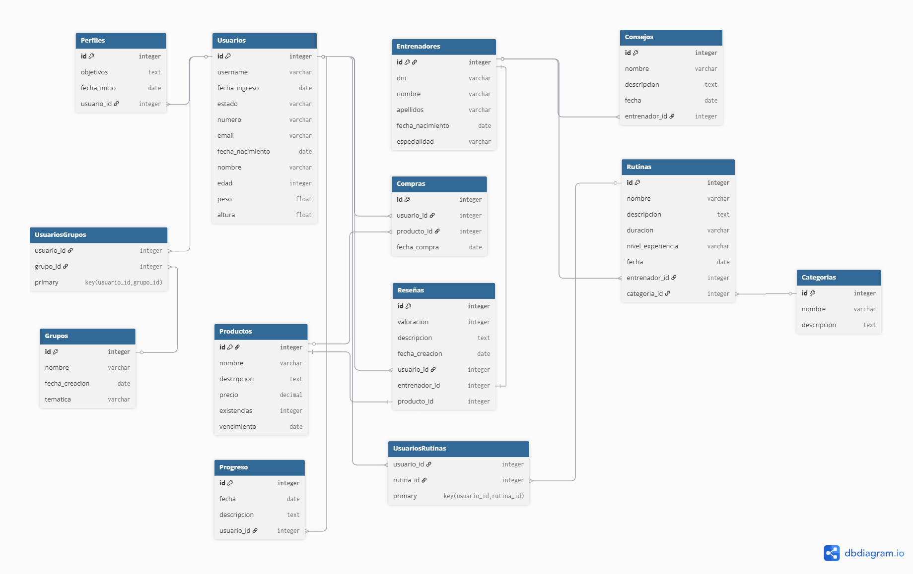

# Ejemplo 3

**NOTA:** Siempre en los enunciados se nos darán prerequisitos que delimitaran el alcance del diagrama, sus elementos y etc, para desarrollar este ejercicios necesitamos seguir los siguientes pasos:

| Paso | Descripción |
| --- | --- |
| **1. Lista predefinida del requisitos** | Comúnmente dada por el docente, delimitan el alcance y enlistan entre palabras de lo que tratará el sistema |
| **2. Identificación de Entidades** | Acá enlistaremos los objetos, personas, lugares o cosa sobre la cual se puede almacenar información. |
| **3. Identificación de Relaciones** | Acá enlistaremos la forma en la que cada entidad se relaciona entre sí, acá agregamos la cardinalidad y se dice la acción que ocurre entre las entidades |
| **4. Identificación de atributos** | Acá definimos los características, elementos o propiedades de los atributos |
| **5. Generalización** | Se definen aclaraciones que necesitemos para indicar que una entidad puede representar tal o tal cosa, ejemplo: un usuario puede ser cliente o empleado |

| Cardinalidades | Significado |
| --- | --- |
| 1:N o 1:M | De uno a muchos |
| 1:1 | De uno a uno |
| N:M | De muchos a muchos |
| 0:1 | De cero a uno |
| 0:N o 0:M | Den cero a muchos |

# Enunciado

1. *Los entrenadores pueden publicar rutinas y consejos de bienestar.*
2. *Los usuarios pueden crear perfiles y seguir rutinas de ejercicio personalizadas.*
3. *Los usuarios pueden registrar su progreso en rutinas y metas de salud.*
4. *La plataforma ofrece productos de belleza y bienestar que los usuarios pueden comprar.*
5. *Los usuarios pueden hacer reseñas y valoraciones de productos y entrenadores.*
6. *Existen categorías de rutinas según objetivos: fuerza, cardio, relajación, belleza de piel, cuidado personal.*
7. *Los usuarios pueden unirse a grupos de interés para compartir consejos y retos.*
8. *Se pueden generar estadísticas de rendimiento y progreso personal.*

# Desarrollo

### **Paso 2.  Identificación de Entidades**

1. Entrenadores
2. Usuarios
3. Rutinas
4. Consejos
5. Perfiles
6. Productos
7. Reseñas
8. Categorías de rutinas
9. Grupos
10. Progreso

### Paso 3: Identificación de relaciones.

1. Entrenadores ↔ Rutinas
    
    Verbo: Un entrenador puede **publicar** rutinas
    
    Cardinalidad: 1:N
    
2. Entrenadores ↔ Consejos
    
    **Verbo**: Un entrenador puede **publicar** Concejos
    
    **Cardinalidad**: 1:N
    
3.  Usuarios ↔ Perfiles
    
    **Verbo**: Un entrenador puede **Crear** perfiles
    
    **Cardinalidad**: 1:N
    
4. Usuarios ↔ Rutinas
    
    **Verbo**: Muchos usuarios puede **seguir** rutinas personalizadas
    
    **Cardinalidad**: N:M o M:M
    
5. Usuario ↔ Progreso
    
    **Verbo**: Un usuario puede **registrar** progreso en rutinas
    
    **Cardinalidad**: 1:N
    
6. Productos ↔ Usuarios
    
    **Verbo**: Muchos productos pueden ser **comprados** por un usuario
    
    **Cardinalidad**: N:1
    
7. Usuario ↔ Reseñas
    
    **Verbo**: Un usuario puede **realizar** reseñas
    
    **Cardinalidad**: 1:N
    
8. Reseñas ↔ Entrenadores
    
    **Verbo**: Una reseña **pertenece** a un entrenador
    
    **Cardinalidad**: 1:1
    
9. Reseñas ↔ Productos
    
    **Verbo**: Una reseña **pertenece** a un producto
    
    **Cardinalidad**: 1:1
    
10. Categorías ↔ Rutinas
    
    **Verbo**: Una rutina **tiene** 1 o muchas categorias
    
    **Cardinalidad**: 1:N
    
11. Grupos ↔ Usuarios
    
    **Verbo**: Un usuario puede **pertenecer** o no, uno o muchos grupos
    
    **Cardinalidad**: M:N
    

### **Paso 4.  Identificación de atributos**

1. **Entrenadores:** DNI, Nombre, Apellidos, Fecha de nacimiento, especialidad.
2. **Usuarios:** Username, Fecha de ingreso, Estado, Número, email, Fecha de nacimiento, Nombre, edad, peso, altura.
3. **Rutinas:** Nombre, Descripción, duración, nivel de experiencia, fecha.
4. **Consejos**: Nombre, Descripción, fecha.
5. **Perfiles**: objetivos, fecha inicio.
6. **Productos**: Nombre, descripción, precio, existencias, vencimiento.
7. **Reseñas**: Valoración, descripción, fecha de creación.
8. **Categorías de rutinas**: Nombre, descripción
9. **Grupos**: Nombre, fecha de creación, temática.
10. **Progreso:** Fecha, descripción.

### Paso 5: Generalizaciones

Los **usuarios** a la vez son clientes, las estadísticas de rendimiento y progreso personal se sacarán con los datos del **progreso**, un usuario hace una **reseña** y esa reseña puede ser de **producto** o un **entrenador**, las categorias son por rutinas.

## Diagrama Chen

Diagrama entidad relación

